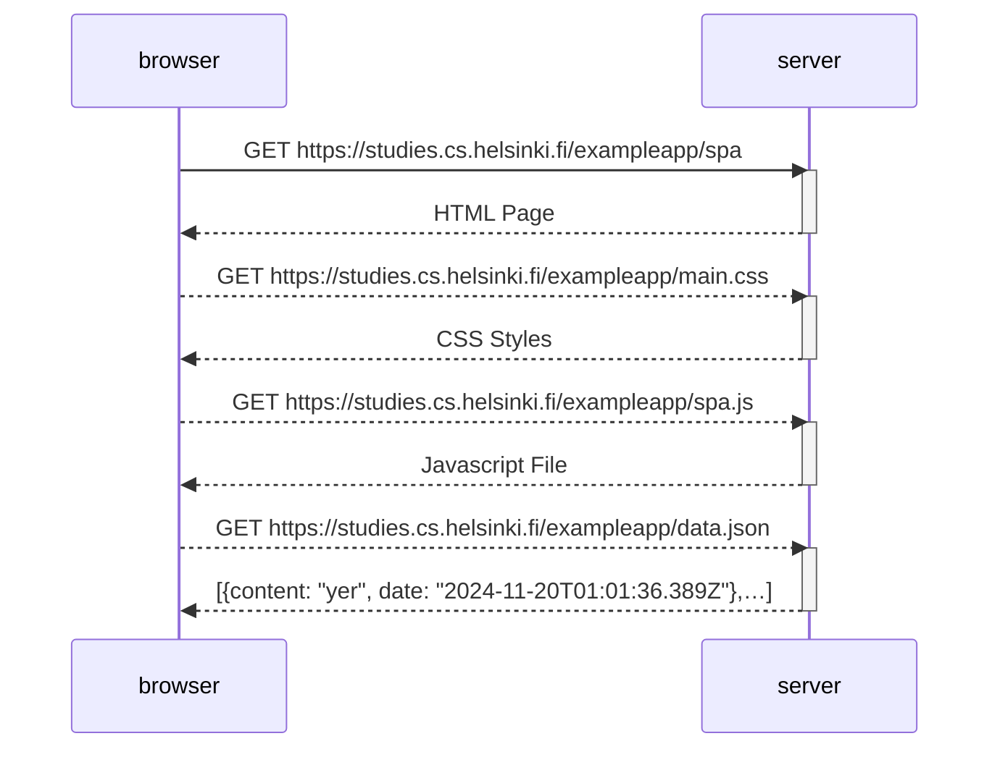

```mermaid
    sequenceDiagram
        participant browser
        participant server
        
        browser->>server: GET  https://studies.cs.helsinki.fi/exampleapp/spa
        activate server
        server-->>browser: HTML Page
        deactivate server

        browser-->>server: GET https://studies.cs.helsinki.fi/exampleapp/main.css
        activate server
        server-->>browser: CSS Styles
        deactivate server

        browser-->>server: GET https://studies.cs.helsinki.fi/exampleapp/spa.js
        activate server
        server-->>browser: Javascript File
        deactivate server

        browser-->>server: GET https://studies.cs.helsinki.fi/exampleapp/data.json
        activate server
        server-->>browser: [{content: "yer", date: "2024-11-20T01:01:36.389Z"},…]
        deactivate server
```
